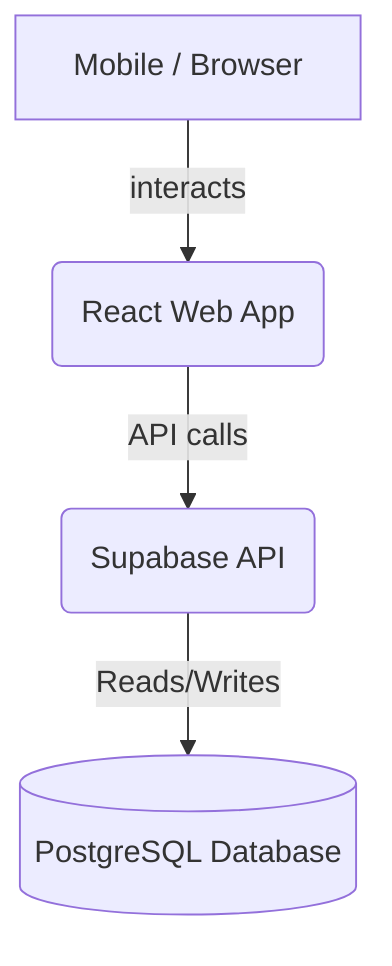

# 📘 Final Product Requirements Document (PRD)

## Product Name
**Smart Semester Attendance Tracker**

---

## 1. Product Overview
Smart Semester Attendance Tracker is a mobile-friendly web application that allows students to track attendance throughout an academic semester using their weekly timetable, semester duration, and holidays.

The system automatically generates class sessions based on:
- Semester start & end date
- Weekly timetable
- User-defined holidays

Users can mark attendance per session, view subject-wise statistics, and predict whether they can safely miss classes while maintaining the required attendance percentage.

- **Backend** will be built using Supabase (PostgreSQL + API + Auth).
- **Frontend** will be a responsive web app compatible with mobile devices.

---

## 2. Problem Statement
Students often struggle to track attendance because:
- Classes follow weekly schedules, not fixed counts
- Holidays reduce total classes
- Attendance percentage changes dynamically
- Manual calculation is error-prone
- Students cannot predict safe bunk limits

A smart system based on semester duration + timetable + holidays solves this.

---

## 3. Product Goals

### Primary Goals
- Track attendance across entire semester
- Generate classes automatically
- Handle holidays correctly
- Show attendance percentage
- Provide attendance prediction

### Secondary Goals
- Mobile-friendly UI
- Fast attendance marking
- Simple dashboard
- Reliable storage using Supabase
- Offline-like fast feel (optimistic UI)

---

## 4. Target User
**Single user:**
- College student
- Wants personal attendance tracking
- Uses mobile mostly
- Needs quick updates

---

## 5. Platform & Tech Stack

### Frontend
- React / Next.js / Vite
- Tailwind CSS
- Responsive layout
- Mobile first design
- PWA compatible (optional)

### Backend
- Supabase
  - PostgreSQL database
  - REST API
  - Row level security
  - Auth (optional)
  - Realtime (optional)

### Architecture


---

## 6. Core Features

### 6.1 Semester Configuration
User sets semester duration.

**Inputs:**
- Semester start date
- Semester end date
- Minimum attendance percentage (default 75%)

**Example:**
| Field | Value |
|---|---|
| Start Date | Aug 1 |
| End Date | Nov 30 |
| Required % | 75 |

System stores configuration.

### 6.2 Subject Management
User creates subjects.

**Fields:**
- Subject name
- Color (optional)
- Short name (optional)

**Example:**
| Subject |
|---|
| DBMS |
| OS |
| CN |
| DSA |

### 6.3 Weekly Timetable Setup
User defines which subjects occur on which day. Supports multiple subjects per day on any weekday.

**Example:**
| Day | Subjects |
|---|---|
| Monday | DBMS |
| Tuesday | DSA |
| Wednesday | OS |
| Thursday | DBMS |
| Friday | CN |

Stored as weekday mapping.
**Weekday format:** 0 = Sunday, 1 = Monday, … 6 = Saturday

### 6.4 Automatic Class Generation
System generates class sessions using:
- Semester start date
- Semester end date
- Timetable

**Algorithm:**
```text
For each date in semester:
  check weekday
  find subjects for that weekday
  create class session
```

**Example output:**
| Date | Subject |
|---|---|
| Aug 3 | DBMS |
| Aug 10 | DBMS |
| Aug 17 | DBMS |

Sessions stored in DB.

### 6.5 Holiday Management
User can add holidays.

**Fields:**
- Holiday name
- Holiday date

**Example:**
| Name | Date |
|---|---|
| Independence Day | Aug 15 |
| Dussehra | Oct 12 |

**Rule:** If holiday = class date → class excluded. Totals update automatically.

### 6.6 Attendance Tracking
User marks attendance per class.

**Options:**
- Present
- Absent
- Cancelled (optional)
- Holiday (auto)

**Example:**
| Date | Subject | Status |
|---|---|---|
| Aug 3 | DBMS | Present |
| Aug 10 | DBMS | Absent |

Must be very fast for mobile.
**UX requirement:** Tap → Present, Tap again → Absent.

### 6.7 Attendance Dashboard
Shows subject-wise stats.

| Subject | Attended | Total | % |
|---|---|---|---|
| DBMS | 32 | 40 | 80% |
| OS | 18 | 25 | 72% |

**Color rules:**
| % | Color |
|---|---|
| ≥ 75 | Green |
| 70–75 | Yellow |
| < 70 | Red |

Dashboard must work on mobile.

### 6.8 Attendance Predictor
Predict safe bunk limit.

**Formula:** `required = p * total`
- `p` = required percentage
- `total` = total classes

**Example:**
Total = 60, Required = 0.75 × 60 = 45, Attended = 40
Need: `45 - 40 = 5`

**Predictor shows:**
| Metric | Value |
|---|---|
| Total | 60 |
| Attended | 40 |
| Required | 45 |
| Must Attend | 5 |
| Can Miss | 15 |

Also show: ✅ Safe / ⚠ Risk / ❌ Shortage

### 6.9 Mobile UI Requirements
Must support:
- Phone screens
- Touch friendly buttons
- Bottom navigation
- Fast load

**Pages:** Dashboard, Attendance, Timetable, Holidays, Settings

---

## 7. Functional Requirements

| ID | Requirement |
|---|---|
| FR1 | User sets semester |
| FR2 | User creates subjects |
| FR3 | User sets timetable |
| FR4 | System generates sessions |
| FR5 | User adds holidays |
| FR6 | Holiday classes removed |
| FR7 | User marks attendance |
| FR8 | Show percentages |
| FR9 | Show predictor |
| FR10 | Mobile responsive UI |

---

## 8. Non-Functional Requirements

- **Performance**: Page load < 1s, Attendance update instant
- **Reliability**: No data loss, Supabase persistence
- **Usability**: 1 tap attendance, Mobile friendly
- **Security**: Supabase RLS, Optional login

---

## 9. Database Schema (Final)

### `subjects`
| column | type |
|---|---|
| id | uuid |
| name | text |
| color | text |
| created_at | timestamp |

### `timetable`
| column | type |
|---|---|
| id | uuid |
| subject_id | uuid |
| weekday | int |

### `sessions` (all generated classes)
| column | type |
|---|---|
| id | uuid |
| subject_id | uuid |
| class_date | date |

### `attendance`
| column | type |
|---|---|
| id | uuid |
| session_id | uuid |
| status | text |

### `holidays`
| column | type |
|---|---|
| id | uuid |
| holiday_name | text |
| holiday_date | date |

### `semester`
| column | type |
|---|---|
| id | uuid |
| start_date | date |
| end_date | date |
| required_percentage | int |

---

## 10. Screens List
- Dashboard
- Mark Attendance
- Subjects
- Timetable
- Holidays
- Predictor
- Settings

---

## 11. Success Metrics
User can:
- Track attendance daily
- See correct %
- Know safe bunk count
- Use on mobile easily

---

## 12. Future Features
- Calendar view
- Notifications
- PWA install
- Export PDF
- Multi-semester
- Cloud sync
- Smart bunk planner

---

## 13. Recommended Stack for Vibe Coding
- ✅ React + Vite
- ✅ Tailwind
- ✅ Supabase
- ✅ shadcn/ui
- ✅ Zustand / Context
- ✅ dayjs
- ✅ PWA plugin
